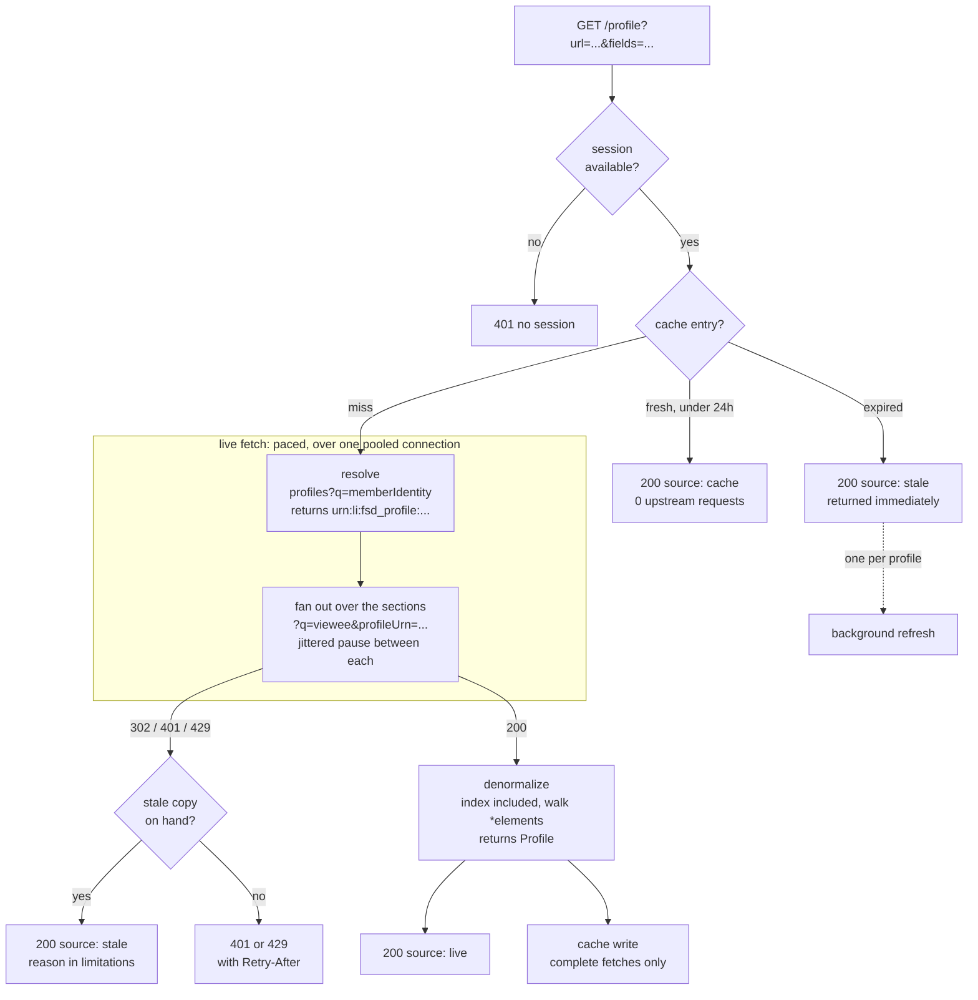

# LinkedIn Profile API

[](https://github.com/CulturalProfessor/linkedin-profile-api/actions/workflows/ci.yml)

A LinkedIn profile URL goes in, structured JSON comes out: name, headline,
location, about, experience, education, skills, certifications, languages and
images. It is purely reverse engineered, calling LinkedIn's own internal
Voyager endpoints directly. There is no browser automation here, and no
HTML or JSON-LD scraping.

## Try it

The deployment URL is supplied with the submission rather than written here,
since this repository is public and the instance replays a real LinkedIn
session. Substitute it below, or your own deployment, or
`http://127.0.0.1:8000` from [Running locally](#running-locally).

```bash
curl -s 'https://<your-deployment>/profile?url=https://www.linkedin.com/in/satyanadella' | jq
```

Trimmed from an actual response (5 roles and 3 schools come back; one of each
is shown):

```jsonc
{
  "profile": {
    "public_identifier": "satyanadella",
    "name": "Satya Nadella",
    "headline": "Chairman and CEO at Microsoft",
    "location": "US",
    "about": "As chairman and CEO of Microsoft, I define my mission and that of my company as ...",
    "experience": [
      { "company": "Microsoft", "company_urn": "urn:li:fsd_company:1035",
        "title": "Chairman and CEO", "location": "Greater Seattle Area",
        "start": "2014-02", "end": null }
    ],
    "education": [
      { "school": "University of Wisconsin-Milwaukee", "degree": "Master's Degree",
        "field_of_study": "Computer Science", "start": null, "end": null }
    ],
    "skills": [], "certifications": [], "languages": [],
    "images": { "profile_picture": "https://media.licdn.com/dms/image/...", "background_picture": "..." }
  },
  "limitations": [
    "location is a country code only (e.g. 'IN') - ...",
    "1 education entry has no school name - LinkedIn returned only a schoolUrn ..."
  ],
  "meta": {
    "source": "live",          // live | cache | stale
    "duration_ms": 8405,
    "upstream_requests": 7,
    "quota_remaining": 139,
    "request_id": "2334466bff6f4037"
  }
}
```

Both `limitations` entries are real, and they show how this API reports
degraded data rather than hiding it. That profile genuinely has one education
entry LinkedIn returns with `schoolName` null and no `School` entity to resolve
the urn against, and its `geoUrn` matches none of the member's role locations,
so `location` falls back to the country code. See
[Limitations](#limitations).

Ask for less and it costs less. `?fields=name,headline` needs one upstream
request instead of seven, about half a second rather than nine:

```bash
curl -s 'https://<your-deployment>/profile?url=satyanadella&fields=name,headline' | jq
```

Interactive docs are at `/docs` (FastAPI's generated OpenAPI UI), and `/health`
reports the deployment's posture and remaining quota.

The service carries a backend LinkedIn session, so no credentials are needed to
try it. You can also send your own with `x-li-cookie`, which spends your
account's quota instead of the demo one. See [Auth model](#auth-model).

## Contents

- [How it works](#how-it-works) - the endpoints, the fan out, and how a response is assembled
- [API](#api) - parameters, response shape, headers, errors
- [Auth model](#auth-model) - how a session gets in, and how to capture one
- [Account safety](#account-safety) - quotas, pacing, and the legal framing
- [What actually got sessions revoked](#what-actually-got-sessions-revoked) - where most of the work went
- [Running locally](#running-locally), [Tests](#tests), [Configuration](#configuration), [CI](#ci), [Docker](#docker), [Deployment](#deployment)
- [Limitations](#limitations)


## How it works


LinkedIn's web profile page is now server-driven UI backed by
`/voyager/api/graphql`. The old one-call aggregators
(`identity/profileView`, `identity/dash/profileCards`,
`identity/dash/profileComponents`) are retired and 404. What's still live is
a set of **per-section dash endpoints** - the same architecture the profile
page's own JS uses:

1. **Resolve once**: `GET /voyager/api/identity/dash/profiles?q=memberIdentity&memberIdentity={publicId}`
   returns the profile entity and its URN (`urn:li:fsd_profile:...`).
2. **Fan out**: for each section in `FETCHED_SECTIONS` - `profilePositionGroups`,
   `profilePositions`, `profileEducations`, `profileSkills`,
   `profileCertifications`, `profileLanguages` - `GET
   /voyager/api/identity/dash/{section}?q=viewee&profileUrn={urn}`, with a
   jittered pause between each. Other known-good section paths
   (courses, projects, honors, volunteering) are listed in `SECTION_PATHS` but
   deliberately not fetched: nothing maps them into the output yet, so they
   only spent requests against the session to build data that was discarded.
3. **Denormalize**: every response has the same shape -
   `{"data": {"*elements": [urn, ...]}, "included": [entity, ...]}`.
   `included` is an unordered bag; `app/denormalize.py` builds an
   `entityUrn -> entity` index and walks `*elements` in order to reassemble
   each section, then maps LinkedIn's internal field names onto the API's
   output shape (see [`app/models.py`](app/models.py)).

**Experience is assembled from `profilePositions`, not
`profilePositionGroups`.** A position *group* carries a single date range
spanning the member's entire tenure at a company, so deriving each role's
dates from it reports every role at a multi-role company as having started
when the member joined and never ended - on the profile this was found
against, four sequential Mastercard roles all rendered as "2010 - present".
Each `Position` carries its own `dateRange`, `title`, `description` and
location. The group is still used to fill in a company name or date range an
individual position omits, and to keep companies that have no position entity
of their own - all that's lost for those is the title.

The response shapes were captured live against a real profile during
development, then rebuilt as three fully synthetic fixtures for the repo -
`fixtures/sample_raw.json`, `sample_raw_notable.json` and
`sample_raw_multirole.json` - so no real person's data ships in a public
repo. All three are consumed field-for-field by
[`tests/test_denormalize.py`](tests/test_denormalize.py); together they cover
in-progress roles (no end date), multiple sequential roles at one company
each keeping their own dates, city resolution via a position's `geoUrn` and
the country-code fallback when it misses, a company present only as a
position group, multiple degrees, and entirely absent optional sections. Both
`profiles?q=memberIdentity` (step 1) and the per-section `q=viewee` calls
were confirmed live against a real profile.

### Why not the official API?

LinkedIn's OAuth API only returns the *authenticated user's own* profile -
there's no arbitrary-profile-by-URL endpoint on it. It's a dead end for this
task by design, not an oversight.

### The path a request takes



`fields` decides how much of that fan out actually happens. Everything on the
resolve response is free, so `name`, `headline`, `about` and `images` cost one
request between them, while the full set costs seven.


## API


### `GET /profile`

| Param / Header | Required | Description |
|---|---|---|
| `url` (query) | yes | Full profile URL or bare public identifier |
| `force_refresh` (query) | no | Bypass cache and re-fetch live |
| `fields` (query) | no | Comma-separated subset of output fields. Default: all |
| `x-li-cookie` (header) | no* | **Recommended.** The whole `Cookie` header from a real linkedin.com request |
| `x-li-at` (header) | no* | Minimal alternative: just the `li_at` cookie |
| `x-jsessionid` (header) | no* | Paired with `x-li-at` |
| `x-api-key` (header) | no** | Required to spend the *backend* session on a deployment that sets `API_KEY` |

\* required unless a backend demo session is configured. `x-li-cookie` wins
when both forms are supplied.

\** Only demanded from callers who don't bring a session of their own. If you
send your own `x-li-cookie` you're spending your own account's risk budget, so
there is nothing for the key to protect. A malformed `x-li-cookie` doesn't
count as bringing your own: it falls through to the backend cookie, so the key
is still required. `/health` stays open either way, so a monitor can see the
service without holding the key.

Leaving `API_KEY` unset makes `/profile` open, which is the right setting for a
public demo and the wrong one for anything long lived: a deployment carrying a
backend cookie with no key is an open proxy for that LinkedIn account, capped
only by the daily quota. The app logs a startup warning when that combination
is configured.

```bash
curl -s 'https://<your-deployment>/profile?url=https://www.linkedin.com/in/satyanadella' | jq
```

A live fetch takes roughly 8 to 10 seconds: seven upstream Voyager requests with a
jittered pause between each (see the guardrails above). Cache hits return
immediately and are marked `"source": "cache"`.

#### Narrowing the response with `fields`

Latency here is almost entirely the paced section fan-out, so the way to make
a call fast is to make fewer requests. Every output field maps to exactly one
section, and `?fields=` lets a caller pay only for what they use:

```bash
curl -s 'https://<your-deployment>/profile?url=<url>&fields=name,headline' | jq
```

| `fields=` | Upstream requests | Roughly |
|---|---|---|
| `name`, `headline`, `about`, `images` (any combination) | 1 | ~0.5s |
| `location` | 2 | ~1.5s |
| `education` / `skills` / `certifications` / `languages` (each) | 2 | ~1.5s |
| `experience` | 3 | ~2.5s |
| omitted (all fields) | 7 | ~9.5s |

Some details worth knowing:

- **`public_identifier` and `name` are always included.** Both come off the
  resolve call at no extra cost, and a response you can't tie back to a person
  isn't much use.
- **Unrequested fields are absent from the JSON, not empty.** A missing key
  means "you didn't ask for this"; `"skills": []` means "this member has no
  skills". Returning `[]` for both would make a narrow query look like a very
  sparse profile. `meta.fields` lists what the response actually carries.
- **`location` costs a section**, which is not obvious - it pulls
  `profilePositions`. The readable city string appears nowhere in the resolve
  response; the denormalizer recovers it by matching the profile's `geoUrn`
  against the geoUrn→name pairs the *positions* response carries. Skipping
  that request would silently degrade `?fields=location` to a country code.

#### Staleness: `source: "stale"`

Cache entries expire after 24h, but an expired entry is not thrown away. It is
served in two situations, both marked `meta.source: "stale"` with a note in
`limitations` saying which, so a caller is never silently handed old data.

- **Expired, refreshing behind you.** The caller who arrives after expiry used
  to pay the full fan-out. They now get the stale copy in ~0.2s and a refresh
  starts behind the response, so the next caller gets fresh data. Only one
  refresh runs per profile at a time, and a refresh that fails leaves the stale
  entry where it was. Losing good stale data because the refresh of it failed
  would make this worse than plain expiry.
- **Live fetch failed, stale copy exists.** A dead session used to turn every
  request into a `401`, including requests for cached profiles that needed no
  session at all. The stale copy is returned instead, with `limitations` naming
  the upstream status.

`404` is the exception: "no such member" may mean the profile was deleted or
renamed, and answering that with old data asserts something no longer true.
Every other failure is about us, which says nothing about whether the cached
copy is still accurate.

Live fan-outs are serialized, because a background refresh running underneath a
foreground fetch would put two interleaved paced sequences on one connection.
Under normal single-caller traffic this never contends.

#### Where the cache lives

Two backends behind one interface, chosen by `CACHE_BACKEND` (`auto` by
default: Upstash when configured, disk otherwise), mirroring the quota
counter's split.

| | `DiskCache` | `UpstashCache` |
|---|---|---|
| Storage | JSON files under `CACHE_DIR` | The Redis the quota counter already uses |
| Survives a restart | no | yes |
| Read latency | ~0.2s | ~0.45s |
| Good for | local development | any real deployment |

Disk was close to decorative on Render's free tier, where the container and its
filesystem are replaced on every deploy and after ~15 minutes idle: entries
rarely survived long enough for the TTL or the stale paths to mean anything.

**Expiry is decided in application code, never by Redis.** `EXPIRE` *deletes*
the key when it fires, which would destroy the stale copy at exactly the moment
the two paths above need it, collapsing both into a hard 24h cliff. Entries
carry their own `cached_at`; the Redis TTL is seven days and is only garbage
collection.

Both backends write atomically (temp file plus `os.replace` on disk, `SET` on
Redis) and never raise on read: anything unreadable, malformed or written by an
older schema is a miss. A failed write is logged and swallowed, since the
response the caller is waiting on is already computed. Upstash retries once on
a short timeout, because a false miss costs a full fan-out *and* a unit of
quota.

#### Response headers

Every response carries `X-Request-ID` (the same id in the logs and in
`meta.request_id`). Any response that can identify an account also carries:

```
X-RateLimit-Limit:     150
X-RateLimit-Remaining: 147
X-RateLimit-Reset:     1788134400   # unix ts, next UTC midnight
Retry-After:           3600         # 429 only
```

The quota day is keyed on the **UTC** date, so `X-RateLimit-Reset` is true
regardless of which region the service is deployed in.

#### The `meta` block

```jsonc
"meta": {
  "source": "live",                 // live | cache | stale
  "fetched_at": "2026-08-30T…",
  "request_id": "01j2f4a9c1b7",
  "duration_ms": 9480,
  "upstream_requests": 7,           // 0 on a cache hit
  "fields": ["name", "headline"],   // what this response carries
  "cache_age_seconds": null,        // null on a live fetch
  "quota_remaining": 147            // null if the quota store was unreachable
}
```

`source` and `fetched_at` are still duplicated at the top level for existing
consumers, and are deprecated in favour of `meta`. `quota_remaining` is
best-effort: a blip reading the shared Upstash counter reports `null` rather
than failing a response that is otherwise perfectly good.

Note `upstream_requests` against the quota: the daily quota counts `/profile`
calls, so real traffic on the account is up to **7×** the number the counter
shows. A fetch that fails *after* reaching LinkedIn is not refunded - the
requests were made and the exposure was spent. A fetch that fails before
issuing any upstream request is refunded.

### `GET /health`

Liveness, deployment posture (`allow_live`, `api_key_required`,
`shared_quota_store`, `daily_quota`, `quota_resets_at`) and the backend
session's remaining daily quota. No auth required, deliberately - a monitor
must be able to tell the service is up without holding the API key.


## Auth model

The caller supplies **their own** LinkedIn session, in one of two shapes:

```
x-li-cookie: <the full Cookie header value from a real linkedin.com request>   # recommended
```
```
x-li-at: <li_at cookie value>        # minimal alternative
x-jsessionid: <JSESSIONID cookie value>
```

`x-li-cookie` wins when both are present. The minimal pair replayed **in
isolation**, stripped of the `bcookie`, `lidc` and other cookies it normally
travels with, is itself a signal LinkedIn's session-anomaly detection can key
on; the whole jar reads much closer to a real browser request.
`app/voyager_client.py` sends the standard `sec-ch-ua`, `sec-fetch-*`,
`accept-language` and `referer` headers a real Voyager XHR carries, for the
same reason. None of this is evasion: it is the same "look like the browser tab
that is supposed to be making this request" principle the guardrails below are
built on.

Values come from a normal logged-in browser session and are used in memory for
that one request, never stored or logged. If nothing is sent, the backend falls
back to an optional demo session from `LINKEDIN_FULL_COOKIE_B64` (preferred),
`LINKEDIN_FULL_COOKIE`, or `LINKEDIN_LI_AT` / `LINKEDIN_JSESSIONID`, checked in
that order and never committed. The `_B64` form exists because a raw cookie
contains quotes, `#` and spaces that collide with `.env`'s own quoting rules
depending on how it is pasted (this bit us during testing); base64 only ever
produces `[A-Za-z0-9+/=]`, so it cannot misparse. The plain form works if the
whole value is wrapped in single quotes.

**Capturing a session.** In DevTools go to Network, click any
`www.linkedin.com` request, then right-click and Copy as cURL (bash):

```bash
python3 tools/curl_to_env.py    # paste, then press Enter
python3 tools/check_session.py  # one request: is it live?
```

The copied command already carries the complete Cookie header the browser sent,
`li_at` included, so nothing is copied by hand. It is read from stdin rather
than as an argument so a live session does not land in shell history or `ps`
output, and `.env` is rewritten atomically at mode 600 with every other line
preserved.

`check_session.py` answers "is my cookie dead, or is my code wrong?" in a
single Voyager request rather than the seven a `/profile` fetch costs, and
tells an expired session (302 to login) from a throttled one (429) from a wrong
public identifier. Use it right after capturing, not habitually before every
fetch: it runs in its own process and so opens its own connection, and
connections are the scarce resource (see
[What actually got sessions revoked](#what-actually-got-sessions-revoked)).

After updating `.env`, **fully stop and restart** the server. `--reload` watches
`.py` files, so editing `.env` alone triggers no reload and the process keeps
serving the previous cookie.

**Replaying a session an open browser tab is also using** can trip LinkedIn's
anomaly detection into invalidating it, forcing a fresh login on whichever
browser holds it, including your own. Header completeness does not fully
eliminate this, since the signal is one token driven by two concurrent clients.
If that is disruptive while testing, capture from a secondary, otherwise idle
browser profile.

This is deliberately **not** a username/password login form. That shape looks
like phishing and it breaks on 2FA. Cookie-based auth against a caller-held
session is the model PhantomBuster and Unipile both use in production.

## Account safety

- Scraping publicly visible data is not a CFAA violation (*hiQ Labs v.
  LinkedIn*, 9th Cir.). The real exposure is LinkedIn's Terms of Service, a
  contract question, not criminal liability.
- Both ToS cases that landed hard (hiQ's underlying conduct, and
  Proxycurl/Nubela in 2025) involved high volume through throwaway or bulk
  accounts. Low-volume reads through one real, established account sit at the
  bottom of that ladder.
- PhantomBuster's published safe limit is ~1,500 profile views per day per
  account. `DAILY_QUOTA` defaults to 150, a tenth of that, and demoing this API
  touches on the order of ten profiles.
- Guardrails: a jittered pause between *every upstream request* rather than
  once per `/profile`, only the sections the output uses and most valuable
  first, a hard daily quota per LinkedIn account, and a kill switch
  (`ALLOW_LIVE=false`) that stops live traffic and serves cache only. The
  reasoning behind each is in
  [What actually got sessions revoked](#what-actually-got-sessions-revoked).
- A session rejected mid-fan-out (302/401/403) fails the request instead of
  being swallowed as an absent section. Returning `200` with a silently gutted
  profile hides a dying session behind an apparently fine response.

None of this makes scraping risk free. It is a judgment call about where on the
risk spectrum this sits, not a legal opinion.

### Quota is per account, not global


The quota exists to cap exposure on *one specific LinkedIn account* - so it's
keyed by account, not shared across every request the service handles. Each
request derives an `account_key` (`app/main.py::_account_key`, a truncated
SHA-256 hash of whichever `li_at` ends up in use - the raw cookie is never
used as a key or written anywhere) and the quota is tracked per key:

- The **backend demo session** (if configured via `LINKEDIN_LI_AT`) has its
  own bucket, capped at `DAILY_QUOTA`.
- Each **caller-supplied session** (`x-li-at` header) gets its own separate
  bucket, keyed off their own cookie's hash.

This matters because a caller bringing their own session is spending *their*
account's risk budget, not the demo account's - a single global counter
would let one caller's traffic exhaust the demo session's daily quota (or
vice versa), and would meaninglessly conflate the risk exposure of several
unrelated real accounts under one number. `/health` reports
`backend_session_remaining_quota_today` for the configured demo session
specifically; a caller's own bucket isn't exposed there since it's scoped to
their own session, not the deployment operator's.

### Shared quota across local and deployed runs


Within one account's bucket, the count also needs to be tracked globally
across *processes*, not just requests - running this locally while it's also
deployed shouldn't let two independent counters each think the same account
has a fresh `DAILY_QUOTA`. `app/quota.py` defines a pluggable `QuotaBackend`,
keyed by `account_key`:

- **`InMemoryQuotaBackend`** (default when unconfigured) - counts in that
  one process only. Fine for solo local testing, but a laptop run and a
  deployed instance won't see each other's usage.
- **`UpstashQuotaBackend`** - a shared counter via
  [Upstash](https://upstash.com)'s free Redis REST API. Both environments
  hit the same HTTPS endpoint, so the count is genuinely global per account.
  Set `UPSTASH_REDIS_REST_URL` and `UPSTASH_REDIS_REST_TOKEN` (from an
  Upstash Redis database's dashboard) to enable it - `/health` reports
  `shared_quota_store: true` once it's active.


## What actually got sessions revoked


Most of the work here went into a session that kept dying after one or two
requests. The findings were counter-intuitive enough to be worth recording,
since they shaped several design decisions above.

**Connection churn, not credentials.** LinkedIn tolerates a replayed session
more or less indefinitely over a *stable* connection, but revokes it after a
handful of new TLS handshakes. The original code built a fresh
`httpx.AsyncClient` per request, so every `/profile` opened a new connection -
which meant the API worked in testing and would have died on a grader's third
call. Two lines of client configuration fixed it: a pooled client owned by the
app's `lifespan`, and `keepalive_expiry=600` in place of httpx's 5-second
default (without which any two requests more than five seconds apart still get
separate connections - i.e. all real traffic). One process now behaves like
one browser tab holding one connection open.

**Pace between requests, not per call.** A single profile is a fan-out of
seven Voyager calls. A delay applied once per `/profile` still let those seven
go out back-to-back; LinkedIn answered the last of them with a 302 to the
login page. The jittered pause belongs in the client, between every request.

**Fail loudly on 302.** A rejected session mid-fan-out was originally
swallowed as "this section is empty", so a dying session returned `200` with a
silently gutted profile - no job titles, no city - which is far worse than an
error. Only `404` is treated as a genuinely absent section now.

**Log what you swallow.** The single highest-value change was logging skipped
sections. `section profilePositions unavailable: 302` is what revealed that
the *last* section in the fan-out was the one dying, and everything above
followed from that. Silent degradation had made the problem invisible.

Things that turned out **not** to be the cause, despite looking convincing:
`li_at` rotation (LinkedIn returns no `Set-Cookie` at all on success), one-use
tokens, and browser-fingerprint mismatch. The `Set-Cookie: li_at; Max-Age=0`
seen on failures is just what an authwall response looks like, not evidence of
what triggered it. Replaying the real captured `user-agent`/`sec-ch-ua`
headers (see `tools/curl_to_env.py`) is still worth doing - a fabricated
fingerprint that contradicts itself is strictly worse than none - but it was
not what fixed this.


## Running locally


```bash
python3 -m pip install --user -r requirements-dev.txt
cp .env.example .env   # fill in a session if you want live fetches
python3 -m uvicorn app.main:app --reload
```

Then open `http://127.0.0.1:8000/docs`.


## Tests


```bash
python3 -m pytest
```

92 tests, no network access required. `tests/test_denormalize.py` runs the
denormalizer against the three synthetic fixtures;
`tests/test_voyager_client.py` drives the fan-out through
`httpx.MockTransport` to cover the fetch set and ordering, failing fast on a
rejected session, tolerating an absent one, connection reuse, and that the
pause happens *between* requests rather than once per profile;
`tests/test_config.py` covers the ways a `.env` can be wrong.

Two helper scripts, neither needed for normal operation:

```bash
python3 tools/curl_to_env.py     # "Copy as cURL" -> .env session + fingerprint
python3 tools/check_session.py   # one request: is the configured session live?
```

`check_session.py` opens its own connection, so avoid running it immediately
before a fetch you care about - see the session notes above.


## Configuration

Settings live in [`app/config.py`](app/config.py) as a `pydantic-settings`
`BaseSettings`, read through an `lru_cache`d `get_settings()`. Values are read
when `Settings()` is called, not at import. This was previously a frozen
dataclass whose defaults called `os.getenv()` at class-definition time, so the
values were fixed at import, `monkeypatch.setenv` could not reach them, tests
had to exercise private helpers instead of the real object, and overriding
anything meant `object.__setattr__`. Both workarounds are gone.

A blank value means "unset", not `""`. `cp .env.example .env` leaves
`DAILY_QUOTA=` behind, and the environment reports that as an empty string
rather than as absent, which used to make `int("")` raise at import: a boot
loop naming neither the variable nor the file. Invalid configuration raises
`ConfigError` at startup rather than booting half-working, and the message
names the environment variable rather than the pydantic field, because that is
what the operator actually set.

## CI

[`.github/workflows/ci.yml`](.github/workflows/ci.yml) runs `ruff check` and
`pytest` on every push and pull request. It needs no secrets: the suite is
entirely offline, so there is no LinkedIn session, no Upstash, and nothing to
leak into a log.

The Python version comes from `.python-version` rather than the workflow, so
CI, the Dockerfile and Render read one number. The Render build once failed on
3.14 because `pydantic-core` had no wheel and fell back to compiling Rust
against a read-only cargo cache; CI drifting to a different Python is how that
would go unnoticed a second time. Lint rules are in
[`pyproject.toml`](pyproject.toml).

```bash
pip install -r requirements-dev.txt && ruff check . && pytest -q
```

## Docker

```bash
docker build -t linkedin-profile-api .
docker run -p 8000:8000 --env-file .env linkedin-profile-api
```

Three decisions in it are deliberate rather than defaults. **One uvicorn
worker, and that is not a number to raise**: each worker gets its own pooled
`httpx` client and so its own TLS connections, and LinkedIn revokes a replayed
session after a handful of those. Adding workers reinstates the bug that killed
sessions after roughly three requests; if you need throughput, cache harder.
**No credentials in any layer**: `.env` and `.cache/` are in
[`.dockerignore`](.dockerignore) and the session arrives at runtime. Tests,
tools and docs are excluded too, which is most of why the image is ~160MB. And
it **runs as a non-root user**, since nothing needs root and the process holds
a session cookie in memory.

The container listens on `$PORT` when the host sets one and 8000 otherwise, so
it works unchanged on Render, Fly or Cloud Run, all of which inject the port and
fail the health check if the process binds a different one.

**The deployed service does not use this image.** It runs on Render's native
Python runtime, chosen when the service was created; adding a Dockerfile does
not change an existing service's runtime. The image makes the deployment
reproducible elsewhere and pins the Python version in a second place.

## Deployment


Any host that runs a standard ASGI app works (Railway, Render, Fly.io).

`.python-version` pins CPython 3.12 deliberately. Hosts that default to a
newer interpreter have no prebuilt `pydantic-core` wheel for it yet and fall
back to compiling it from Rust source, which fails on build images with a
read-only cargo cache. Start command:

```bash
uvicorn app.main:app --host 0.0.0.0 --port $PORT
```

Set environment variables from `.env.example` in the host's dashboard - never
commit real credentials. `tools/curl_to_env.py --print` emits the two session
values (`LINKEDIN_FULL_COOKIE_B64` and `LINKEDIN_BROWSER_HEADERS_B64`) ready
to paste. Also set `UPSTASH_REDIS_REST_URL` / `UPSTASH_REDIS_REST_TOKEN` here
and in your local `.env` if you want local runs and the deployed server to
share one daily quota (see
[Shared quota](#shared-quota-across-local-and-deployed-runs) above).

Pick a region near where the session was captured. The cookie is bound to a
browser on a particular network; replaying it from a datacenter on another
continent is one more thing that reads as anomalous, on top of the datacenter
IP itself. Expect a deployed backend demo session to be less durable than a
local one - which is why `x-li-cookie` (caller-supplied sessions) is the
documented primary path rather than a fallback.


## Limitations


- **City-level location is best-effort.** LinkedIn's profile entity carries
  only `location.countryCode` and an opaque `geoLocation.geoUrn` - the
  readable city string is genuinely absent from that response. Rather than
  make a separate undocumented geo-resolve call, the denormalizer resolves
  the geoUrn against the `geoUrn -> geoLocationName` pairs that the
  **positions** response already carries, which costs nothing extra and
  returns e.g. `"New York City Metropolitan Area"`. When a member's profile
  location doesn't match any of their role locations the lookup misses and
  the output degrades to the country code, with a note in `limitations`.
- **These are internal, undocumented endpoints.** LinkedIn can change field
  names, response shapes, or retire endpoints without notice - as it already
  did to the old aggregator endpoints this project had to route around.
- **Fixtures are synthetic, not real scraped data.** No real profile's
  content ships in this repo; `fixtures/sample_raw.json`,
  `sample_raw_notable.json` and `sample_raw_multirole.json` are hand-built in
  the real Voyager response shape to exercise the denormalizer, not actual
  LinkedIn responses.
- **Four sections are fetched but unmapped.** `profileCourses`,
  `profileProjects`, `profileHonors` and `profileVolunteerExperiences` are
  known-good endpoint paths listed in `SECTION_PATHS`, but nothing maps them
  into the output yet, so they are deliberately not requested - each one is
  another request against the same session for data that would be discarded.
  Wiring them up is the most obvious next extension.
- **A backend demo session is inherently perishable.** It's a real browser
  session being replayed; LinkedIn can revoke it at any time, and a deployed
  instance is more exposed than a local one. Callers supplying their own
  session via `x-li-cookie` are unaffected.
